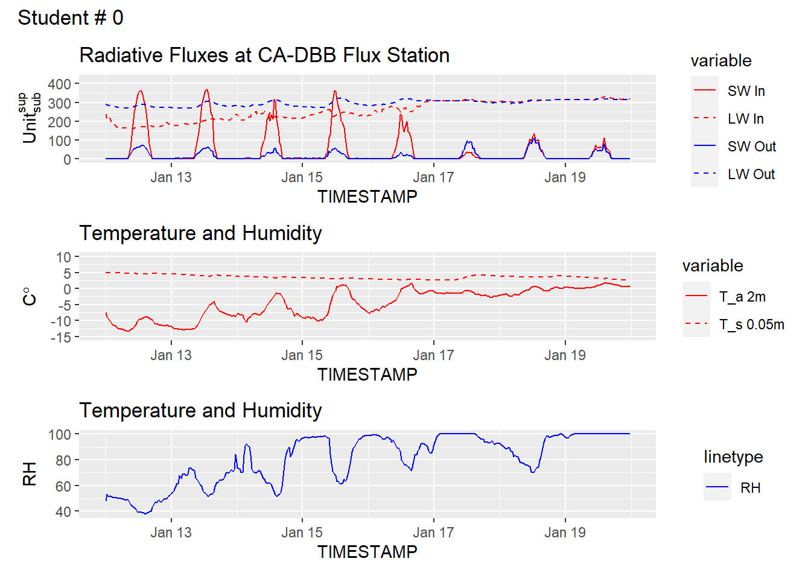

In this lab, assignment, you're going to look at data from the CA-DBB (aka "BB") Eddy Covariance (EC) Station @fig-BB1, located in Delta, BC.  Clicking on "BB" in @fig-map will zoom to the CA-DBB station and show the site's "Flux Footprint Climatology", which is a concept we'll cover later in term.  Clicking the "BB" button again will toggle the footprint later on and off.  You can pan/zoom to get a feel for what the site looks like.  For now, we'll stick to looking at some basic components of the site's energy balance.  In the data files (Climate_Summary_BB.csv & Climate_Summary_BB_Metadata.csv) you will find measurements multiple variables and their corresponding metadata.

::: {#fig-BB1 layout-ncol=2}

{#fig-BB1-RAD}

{#fig-BB1-EC}

:::

::: {#fig-map}

<div style="overflow: hidden;
  padding-top: 55%;
  position: relative">
<iframe src="https://ubc-micromet.github.io/FieldSiteMaps/" title="Processes" scrolling="no" frameborder="0"
style="border: 0;
height: 100%;
left: 0;
position: absolute;
top: 0;
width: 75%;">
</iframe>
</div>
Location of UBC-Micromet Eddy Covariance Stations
:::


::: {.cell}

```{.r .cell-code}
#|echo: True
library("ggplot2")
library("reshape2")
library("latex2exp")
library("patchwork")
library("tidyr")
```

::: {.cell-output .cell-output-stderr}

```

Attaching package: 'tidyr'
```


:::

::: {.cell-output .cell-output-stderr}

```
The following object is masked from 'package:reshape2':

    smiths
```


:::
:::


### Question 1 

Below is an example showing the first few rows of the BB climate summary data.  What value do you see listed for Incoming $SW$ in the first row of the table, is this value reasonable?  What is the value listed for Albedos, is this reasonable?  Why or why not?

* Make suer to specify the units in your answer. Check the metadata provided [here](https://github.com/GEOS300/AssignmentData/blob/main/Climate_Summary_BB_Metadata.md) to make sure you understand the variable names and units.


::: {.cell}

```{.r .cell-code}
Student.Number = 0

# Import the data from github & parse the timestamp for each record
data_url='https://raw.githubusercontent.com/GEOS300/AssignmentData/main/Climate_Summary_BB.csv'
df <- read.csv(file = data_url)
df$TIMESTAMP <- as.POSIXct(df$TIMESTAMP,format = "%Y-%m-%d %H%M")

# Calculate Albedo
df$Albedo = df$SW_OUT_1_1_1/df$SW_IN_1_1_1

# Preview the table using head()
head(df)
```

::: {.cell-output .cell-output-stdout}

```
            TIMESTAMP SW_IN_1_1_1 LW_IN_1_1_1 SW_OUT_1_1_1 LW_OUT_1_1_1
1 2022-01-01 00:30:00  0.05977540    263.2279    1.3582480     271.2144
2 2022-01-01 01:00:00  0.01990683    265.9375    1.1015637     274.9786
3 2022-01-01 01:30:00  0.10298067    268.3632    0.6146293     279.2283
4 2022-01-01 02:00:00  0.02578117    273.8807    0.3941725     281.6006
5 2022-01-01 02:30:00  0.03268367    277.7110    0.3813828     283.5396
6 2022-01-01 03:00:00  0.03338333    277.2797    0.3865185     284.4536
           H       G_1  TA_1_1_1  TA_1_2_1     TS_1     TS_2     TS_3 RH_1_1_1
1 -29.676018 -5.586875 -7.762711 -9.570630 3.630083 4.214648 7.489783 83.28255
2         NA -5.553178 -7.200051 -9.533210 3.677612 4.251830 7.531122 82.64555
3         NA -5.575220 -6.349798 -7.833451 3.669683 4.264247 7.550878 79.34940
4         NA -5.574099 -6.297862 -7.050872 3.692943 4.280375 7.569431 79.83266
5         NA -5.562795 -6.020581 -6.729948 3.708760 4.293371 7.578785 79.85045
6  -6.500002 -5.563889 -5.811514 -6.359775 3.698611 4.284091 7.576676 79.45928
  P_1_1_1 PA_1_1_1  WS_1_1_1  WD_1_1_1 VPD_1_1_1    Albedo
1       0 102.3971 0.6597374 0.6597374 0.5728984 22.722525
2       0 102.4034 1.4010231 1.4010231 0.6211866 55.335956
3       0 102.4177 1.6921777 1.6921777 0.7891113  5.968395
4       0 102.4485 1.8559053 1.8559053 0.7737166 15.289165
5       0 102.4614 2.0136266 2.0136266 0.7896050 11.668912
6       0 102.4637 2.0015748 2.0015748 0.8178825 11.578188
```


:::
:::

### Question 2 

The plot below shows data from the January 2024 cold-snap (Jan 12 to Jan 19) and snowstorm (Jan 17-Jan 19) during which record low temperatures were observed and over 25cm of snow was received across the Metro Vancouver area.  Traces traces of the four radiation component, air & soil temperature, and relative humidity are shown.  Looking at the trace below - what stands out to you?  Comment on the progression of each radiative component over time, using the temperature and humidity data to support your discussion.  Do you see any issues in the data?  If so, what is a possible explanation?


::: {.cell}

```{.r .cell-code}
# Set a time window and query the dataframe
Start ='2024-01-12 0000'
End ='2024-01-20 0000'
Selection <- df[which((df$TIMESTAMP >= Start) & (df$TIMESTAMP <End)),]

# Find the maximum SW_IN and when it occurred
Max_SW_IN = Selection$SW_IN_1_1_1[Selection$SW_IN_1_1_1==max(Selection$SW_IN_1_1_1)]
Max_SW_IN_TIMESTAMP = Selection$TIMESTAMP[Selection$SW_IN_1_1_1==max(Selection$SW_IN_1_1_1)]


# Create a plot with three sub-plots
# Plot the radiation components on the first sub-plot
# Plot Ta and Ts on the second sub-plot, and RH on the third
plot_radiation <- melt(
  Selection[,c('TIMESTAMP','SW_IN_1_1_1','LW_IN_1_1_1','SW_OUT_1_1_1', 'LW_OUT_1_1_1')],
  id="TIMESTAMP")

p1 <- ggplot(plot_radiation, aes(x = TIMESTAMP, y = value, group = variable)) +
  geom_line(aes(color = variable,linetype = variable)) +
  scale_color_manual(labels = c('SW In','LW In','SW Out','LW Out'),values = c('red','red','blue','blue')) +
  scale_linetype_manual(labels = c('SW In','LW In','SW Out','LW Out'), values = c("solid","dashed","solid","dashed"))+
  
  # Note: You can use a markup language called LaTeX to format labels.  Replace Units,subscript, and superscript with the appropriate unit for radiative fluxes
  labs(y = TeX(r"($Unit_{sub}^{sup}$)"))+
  ylim(0,425)+
  ggtitle('Radiative Fluxes at CA-DBB Flux Station')

plot_temp <- melt(
  Selection[,c('TIMESTAMP','TA_1_1_1','TS_1')],
  id="TIMESTAMP")
p2 <- ggplot(plot_temp, aes(x = TIMESTAMP, y = value, group = variable)) +
  geom_line(aes(color = variable,linetype = variable)) +
  scale_color_manual(labels = c('T_a 2m','T_s 0.05m'),values = c('red','red')) +
  scale_linetype_manual(labels = c('T_a 2m','T_s 0.05m'), values = c("solid","dashed"))+
  labs(y = TeX(r"($C\degree)"))+
  ylim(-15,10)+
  ggtitle('Temperature and Humidity')

p3 <- ggplot(Selection, aes(x = TIMESTAMP, y = RH_1_1_1,lty = 'RH')) +
  geom_line(color='blue') +
  labs(y = 'RH')+
  ggtitle('Temperature and Humidity')


p1 / p2 / p3 + plot_annotation(sprintf('Student # %i',Student.Number))
```

::: {.cell-output-display}
{width=672}
:::

```{.r .cell-code}
options(repr.plot.width=8, repr.plot.height=10)
```
:::

## Question 3

The maximum $SW_\downarrow$ observed during this time period was 369.34064 at 2024-01-13 13:00:00  Pacific Standard Time (PST).  The CA-DBB station is located at 49.129 $^{\circ}$ N -122.985 $^{\circ}$ W.  Using the equations from lecture, calculate the Local Apparent Time (LAT), solar declination $\delta$, solar zenith angle $Z$, and extraterrestrial irradiance $I_ex$ for this observation period.  Given the value of $I_ex$, compared to observed $SW_\downarrow$, what is the approximate bulk transmissivity ($\Psi_a$) coefficient of the atmosphere over CA-DBB at this point in time?

b. Now calculate the extinction coefficient for  2024-01-19 13:00:00, when the observed value of $SW_\downarrow$ was 58.37548.  What explains the difference between these two days?


::: {.cell}

```{.r .cell-code}
# Insert your code here
```
:::


::: {.cell}

```{.r .cell-code}
# Insert your code here
```
:::

